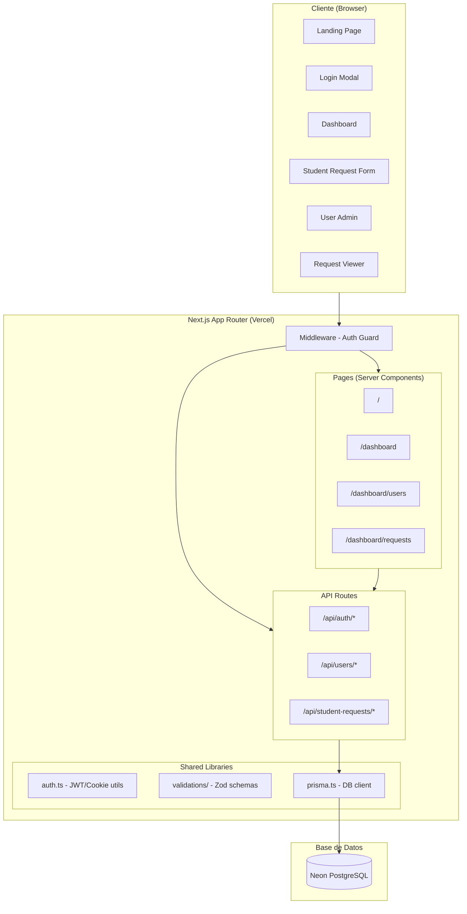
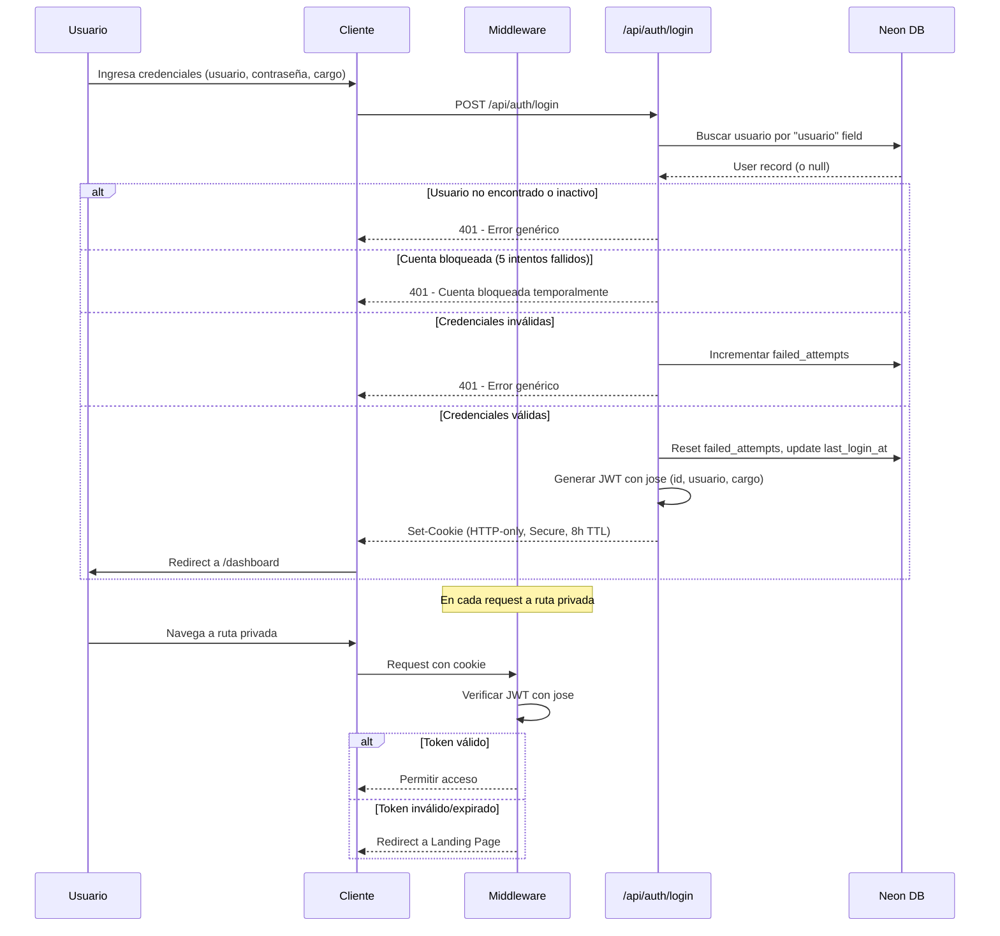
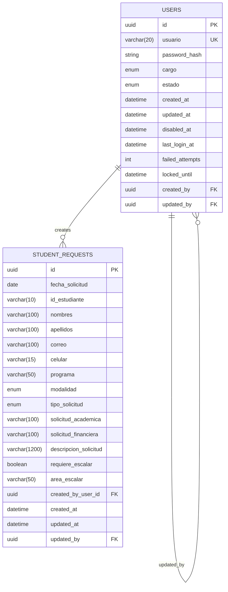

# Design Document: Portal de Gestión de Estudiantes UCC

## Overview

El Portal de Gestión de Estudiantes es una aplicación web full-stack para el programa de Ingeniería Industrial de la Universidad Cooperativa de Colombia (UCC). Permite a docentes, jefes y administrativos gestionar solicitudes estudiantiles, administrar usuarios y exportar datos.

### Stack Tecnológico

| Capa | Tecnología |
|------|-----------|
| Framework | Next.js 14+ (App Router) |
| Lenguaje | TypeScript |
| Estilos | Tailwind CSS + shadcn/ui |
| Animaciones | Framer Motion |
| Base de datos | PostgreSQL (Neon serverless) |
| ORM | Prisma |
| Validación | Zod + React Hook Form |
| Autenticación | JWT (jose) + HTTP-only cookies + bcryptjs |
| Despliegue | Vercel |

### Decisiones de Diseño Clave

1. **JWT en HTTP-only cookie**: Se usa la librería `jose` para firmar/verificar tokens JWT almacenados en cookies HTTP-only. Esto evita exposición a XSS mientras mantiene sesiones stateless.
2. **Middleware de Next.js para protección de rutas**: El middleware intercepta requests a rutas privadas y valida el token antes de permitir acceso.
3. **Validación dual (frontend + backend)**: Zod schemas compartidos entre cliente y servidor garantizan consistencia de validación.
4. **Soft delete para usuarios**: No se eliminan registros físicamente; se usa el campo `estado` para desactivar.
5. **CSV con UTF-8 BOM y delimitador semicolón**: Garantiza compatibilidad con Excel en configuraciones regionales hispanas.

## Architecture

### Diagrama de Arquitectura General



### Diagrama de Flujo de Autenticación



### Estructura de Directorios

```
src/
├── app/
│   ├── layout.tsx                    # Root layout con providers
│   ├── page.tsx                      # Landing Page
│   ├── dashboard/
│   │   ├── layout.tsx                # Dashboard layout (auth check)
│   │   ├── page.tsx                  # Dashboard principal
│   │   ├── users/
│   │   │   └── page.tsx              # User Admin
│   │   └── requests/
│   │       └── page.tsx              # Request Viewer
│   └── api/
│       ├── auth/
│       │   ├── login/route.ts
│       │   ├── logout/route.ts
│       │   └── me/route.ts
│       ├── users/
│       │   ├── route.ts              # GET (list), POST (create)
│       │   └── [id]/
│       │       ├── route.ts          # PATCH (edit)
│       │       └── status/route.ts   # PATCH (activate/deactivate)
│       └── student-requests/
│           ├── route.ts              # GET (list), POST (create)
│           └── export/route.ts       # GET (CSV export)
├── components/
│   ├── ui/                           # shadcn/ui components
│   ├── landing/                      # Landing page components
│   ├── auth/                         # Login modal, auth forms
│   ├── dashboard/                    # Dashboard cards, header
│   ├── users/                        # User admin components
│   ├── requests/                     # Request viewer components
│   └── shared/                       # Loading, error states, etc.
├── lib/
│   ├── auth.ts                       # JWT sign/verify, cookie helpers
│   ├── prisma.ts                     # Prisma client singleton
│   ├── validations/
│   │   ├── auth.schema.ts
│   │   ├── user.schema.ts
│   │   └── student-request.schema.ts
│   └── utils.ts                      # Helpers generales
├── middleware.ts                      # Auth middleware
├── types/
│   └── index.ts                      # TypeScript interfaces
└── prisma/
    ├── schema.prisma
    └── seed.ts
```

## Components and Interfaces

### 1. Módulo de Autenticación (`lib/auth.ts`)

```typescript
// Interfaces principales
interface JWTPayload {
  id: string;          // UUID del usuario
  usuario: string;     // Identificador numérico
  cargo: Cargo;        // Docente | Jefe | Administrativo
  iat: number;         // Issued at
  exp: number;         // Expiration (8h)
}

interface LoginRequest {
  usuario: string;
  contrasena: string;
  cargo: Cargo;
}

interface AuthResponse {
  success: boolean;
  error?: string;
}

// Funciones exportadas
async function signToken(payload: Omit<JWTPayload, 'iat' | 'exp'>): Promise<string>
async function verifyToken(token: string): Promise<JWTPayload | null>
function setSessionCookie(response: NextResponse, token: string): void
function clearSessionCookie(response: NextResponse): void
async function getSessionFromCookie(cookies: ReadonlyRequestCookies): Promise<JWTPayload | null>
```

### 2. Middleware de Protección (`middleware.ts`)

```typescript
// Configuración de rutas
const PRIVATE_ROUTES = ['/dashboard', '/dashboard/users', '/dashboard/requests'];
const PRIVATE_API_ROUTES = ['/api/users', '/api/student-requests'];
const PUBLIC_ROUTES = ['/', '/api/auth/login'];

// Configuración de roles (preparación futura)
interface RoutePermission {
  path: string;
  allowedCargos: Cargo[];
}

// El middleware:
// 1. Extrae el token de la cookie
// 2. Verifica validez con jose
// 3. Si ROLE_RESTRICTIONS_ENABLED=true, verifica cargo contra permitted-roles
// 4. Redirige a Landing si no autenticado (rutas de página)
// 5. Retorna 401 si no autenticado (rutas API)
```

### 3. API de Usuarios (`/api/users`)

```typescript
// GET /api/users - Listar usuarios con paginación y filtros
interface UsersQueryParams {
  page?: number;           // Default: 1
  pageSize?: number;       // Default: 10, options: 10, 25, 50
  usuario?: string;        // Búsqueda parcial
  cargo?: Cargo;           // Filtro exacto
  estado?: Estado;         // Filtro exacto
}

interface PaginatedResponse<T> {
  data: T[];
  pagination: {
    page: number;
    pageSize: number;
    totalPages: number;
    totalRecords: number;
  };
}

// POST /api/users - Crear usuario
interface CreateUserRequest {
  usuario: string;         // Único, numérico, 5-20 chars
  password: string;        // Min 8 chars, se hashea antes de guardar
  cargo: Cargo;
  estado?: Estado;         // Default: Activo
}

// PATCH /api/users/[id] - Editar usuario
interface UpdateUserRequest {
  cargo?: Cargo;
  password?: string;       // Si vacío, no se modifica
}

// PATCH /api/users/[id]/status - Cambiar estado
interface UpdateStatusRequest {
  estado: Estado;
}
```

### 4. API de Solicitudes Estudiantiles (`/api/student-requests`)

```typescript
// GET /api/student-requests - Listar con filtros y paginación
interface StudentRequestsQueryParams {
  page?: number;
  pageSize?: number;
  search?: string;              // Búsqueda general (nombres, apellidos, correo, id_estudiante, descripcion)
  fechaDesde?: string;          // ISO date
  fechaHasta?: string;          // ISO date
  idEstudiante?: string;        // Match exacto
  tipoSolicitud?: TipoSolicitud;
  modalidad?: Modalidad;
  areaEscalar?: string;
  sortBy?: string;              // Campo de ordenamiento
  sortOrder?: 'asc' | 'desc';  // Default: desc
}

// POST /api/student-requests - Crear solicitud
interface CreateStudentRequestBody {
  fecha_solicitud: string;      // YYYY-MM-DD
  id_estudiante: string;        // Max 10 digits
  nombres: string;              // Max 100 chars
  apellidos: string;            // Max 100 chars
  correo: string;               // Email válido
  celular: string;              // Max 15 digits
  programa: string;             // "Ingeniería industrial"
  modalidad: Modalidad;
  tipo_solicitud: TipoSolicitud;
  solicitud_academica?: string | null;
  solicitud_financiera?: string | null;
  descripcion_solicitud: string; // Max 1200 chars
  requiere_escalar: boolean;
  area_escalar?: string | null;
}

// GET /api/student-requests/export - Exportar CSV
// Usa los mismos filtros que el listado
// Retorna: Content-Type: text/csv; charset=utf-8
// Headers: Content-Disposition: attachment; filename=gestion_estudiantes_...csv
```

### 5. Componentes de UI Principales

```typescript
// Landing Page
interface LandingPageProps {}
// - Hero section con animaciones Framer Motion
// - Cards glassmorphism con hover effects
// - Botón "Ingresa aquí" que abre LoginModal
// - Footer con copyright

// Login Modal
interface LoginModalProps {
  isOpen: boolean;
  onClose: () => void;
}

// Dashboard Header
interface DashboardHeaderProps {
  user: { usuario: string; cargo: Cargo };
  onLogout: () => void;
}

// Student Request Form Modal
interface StudentRequestFormProps {
  isOpen: boolean;
  onClose: () => void;
  onSuccess: () => void;
}

// User Admin Table
interface UserAdminProps {}
// - Tabla paginada con filtros
// - Modales para crear/editar
// - Confirmación para desactivar/reactivar

// Request Viewer
interface RequestViewerProps {}
// - Tabla paginada con filtros múltiples
// - Ordenamiento por columnas
// - Botón de exportar CSV
// - Estados: loading, empty, error
```

### 6. CSV Exporter (`/api/student-requests/export`)

```typescript
// Configuración del exportador
const CSV_CONFIG = {
  delimiter: ';',
  encoding: 'utf-8',
  bom: '\uFEFF',  // UTF-8 BOM
  headers: [
    'ID registro', 'Fecha solicitud', 'ID estudiante', 'Nombres',
    'Apellidos', 'Correo', 'Celular', 'Programa', 'Modalidad',
    'Tipo solicitud', 'Solicitud académica', 'Solicitud financiera',
    'Descripción solicitud', 'Requiere escalar', 'Área a escalar',
    'Usuario creador', 'Cargo creador', 'Fecha creación', 'Fecha actualización'
  ],
  filenamePattern: 'gestion_estudiantes_salas_virtuales_YYYY-MM-DD_HH-mm.csv'
};

function generateCSV(records: StudentRequestWithUser[]): string
function formatFilename(date: Date): string
```

## Data Models

### Prisma Schema

```prisma
generator client {
  provider = "prisma-client-js"
}

datasource db {
  provider = "postgresql"
  url      = env("DATABASE_URL")
}

enum Cargo {
  Docente
  Jefe
  Administrativo
}

enum Estado {
  Activo
  Inactivo
}

enum Modalidad {
  Presencial
  Virtual
  Funza
}

enum TipoSolicitud {
  Academico    @map("Académico")
  Financiero
  Certificados
}

model User {
  id              String    @id @default(uuid())
  usuario         String    @unique @db.VarChar(20)
  password_hash   String
  cargo           Cargo
  estado          Estado    @default(Activo)
  created_at      DateTime  @default(now())
  updated_at      DateTime  @updatedAt
  disabled_at     DateTime?
  last_login_at   DateTime?
  failed_attempts Int       @default(0)
  locked_until    DateTime?
  created_by      String?   @db.Uuid
  updated_by      String?   @db.Uuid

  // Self-referential relations
  creator         User?     @relation("UserCreator", fields: [created_by], references: [id])
  updater         User?     @relation("UserUpdater", fields: [updated_by], references: [id])
  createdUsers    User[]    @relation("UserCreator")
  updatedUsers    User[]    @relation("UserUpdater")

  // Relation to student requests
  studentRequests StudentRequest[] @relation("RequestCreator")
  updatedRequests StudentRequest[] @relation("RequestUpdater")

  @@map("users")
}

model StudentRequest {
  id                     String         @id @default(uuid())
  fecha_solicitud        DateTime       @db.Date
  id_estudiante          String         @db.VarChar(10)
  nombres                String         @db.VarChar(100)
  apellidos              String         @db.VarChar(100)
  correo                 String         @db.VarChar(100)
  celular                String         @db.VarChar(15)
  programa               String         @db.VarChar(50)
  modalidad              Modalidad
  tipo_solicitud         TipoSolicitud
  solicitud_academica    String?        @db.VarChar(100)
  solicitud_financiera   String?        @db.VarChar(100)
  descripcion_solicitud  String         @db.VarChar(1200)
  requiere_escalar       Boolean
  area_escalar           String?        @db.VarChar(50)
  created_by_user_id     String         @db.Uuid
  created_at             DateTime       @default(now())
  updated_at             DateTime       @updatedAt
  updated_by             String?        @db.Uuid

  // Relations
  creator                User           @relation("RequestCreator", fields: [created_by_user_id], references: [id], onDelete: Restrict)
  updater                User?          @relation("RequestUpdater", fields: [updated_by], references: [id])

  @@map("student_requests")
}
```

### Diagrama Entidad-Relación



### Seed Data

El sistema se inicializa con un usuario semilla:

```typescript
// prisma/seed.ts
const seedUser = {
  usuario: "1129564302",
  password: await bcrypt.hash("Lifl172023Cf", 12),
  cargo: "Docente",
  estado: "Activo",
  created_by: null  // System-generated
};
```

## Correctness Properties

*A property is a characteristic or behavior that should hold true across all valid executions of a system — essentially, a formal statement about what the system should do. Properties serve as the bridge between human-readable specifications and machine-verifiable correctness guarantees.*

### Property 1: Authentication requires all conditions to match

*For any* login attempt with (usuario, contraseña, cargo), authentication SHALL succeed if and only if: the usuario exists in the database, the password hash matches the provided contraseña, the cargo matches the stored cargo, AND the estado is Activo. Any single condition failing SHALL result in rejection.

**Validates: Requirements 2.2, 2.4**

### Property 2: User enumeration prevention via uniform error responses

*For any* failed login attempt — whether due to non-existent usuario, wrong password, wrong cargo, or inactive estado — the error response message SHALL be identical in content, preventing attackers from distinguishing failure reasons.

**Validates: Requirements 2.5**

### Property 3: Passwords are never stored as plaintext

*For any* password string provided during user creation or password update, the value stored in the database (password_hash) SHALL never equal the original plaintext input.

**Validates: Requirements 2.8**

### Property 4: Account lockout after consecutive failures

*For any* user, after exactly 5 consecutive failed authentication attempts, the account SHALL be locked (locked_until set to current time + 15 minutes). For fewer than 5 consecutive failures, the account SHALL remain unlocked.

**Validates: Requirements 2.9**

### Property 5: Invalid tokens on private routes trigger redirect

*For any* request to a private route (pages under /dashboard) carrying a missing, expired, or malformed Session_Cookie, the middleware SHALL redirect to the Landing Page.

**Validates: Requirements 2.10, 3.1**

### Property 6: Invalid tokens on API routes return 401

*For any* request to a protected API endpoint carrying a missing, expired, or malformed Session_Cookie, the server SHALL respond with HTTP status 401 and a JSON error body.

**Validates: Requirements 3.2, 3.4**

### Property 7: /me endpoint faithfully returns JWT payload

*For any* valid Session_Cookie containing a JWT with fields (id, usuario, cargo, estado), the GET /api/auth/me endpoint SHALL return a JSON response containing those exact same field values.

**Validates: Requirements 3.3**

### Property 8: Conditional field visibility and persistence

*For any* tipo_solicitud value and requiere_escalar value in a student request form submission:
- When tipo_solicitud is "Académico", solicitud_academica SHALL be required and solicitud_financiera SHALL be null
- When tipo_solicitud is "Financiero", solicitud_financiera SHALL be required and solicitud_academica SHALL be null
- When tipo_solicitud is "Certificados", both solicitud_academica and solicitud_financiera SHALL be null
- When requiere_escalar is false, area_escalar SHALL be null
- When requiere_escalar is true, area_escalar SHALL be required

**Validates: Requirements 5.3, 5.4, 5.5, 5.7, 5.8**

### Property 9: Character counter accuracy

*For any* string of length N entered in the descripcion_solicitud field (where 0 ≤ N ≤ 1200), the live character counter SHALL display exactly (1200 - N) as the remaining character count.

**Validates: Requirements 5.6**

### Property 10: Frontend and backend validation schema consistency

*For any* student request form input data, the frontend Zod schema and the backend Zod schema SHALL produce identical validation outcomes — both accept or both reject, with the same set of field-level errors.

**Validates: Requirements 5.10, 11.1**

### Property 11: User list filter correctness

*For any* set of user records and any combination of filters (usuario partial match, cargo exact match, estado exact match), the returned results SHALL contain only records that satisfy ALL applied filter conditions simultaneously.

**Validates: Requirements 6.2**

### Property 12: User creation validation with uniqueness enforcement

*For any* user creation request, validation SHALL accept only when: usuario is numeric with 5-20 characters AND is unique in the database, password has ≥ 8 characters, and cargo is a valid enum value. If usuario already exists, the request SHALL be rejected with a descriptive error and no record SHALL be created.

**Validates: Requirements 6.3, 6.8**

### Property 13: Empty password on edit preserves existing hash

*For any* user edit request where the password field is empty or null, the resulting password_hash in the database SHALL remain identical to the value before the edit operation.

**Validates: Requirements 6.4**

### Property 14: Disable then reactivate restores active state

*For any* active user, disabling (setting estado to Inactivo) and then reactivating SHALL result in estado = "Activo" and disabled_at = null, restoring the user to a fully active state.

**Validates: Requirements 6.5, 6.6**

### Property 15: Audit fields recorded on every modification

*For any* user modification performed by an authenticated user, the updated_by field SHALL equal the modifier's user id, and updated_at SHALL be set to the current timestamp.

**Validates: Requirements 6.7**

### Property 16: Student request filter correctness

*For any* set of student request records and any combination of filters (text search, date range, id_estudiante, tipo_solicitud, modalidad, area_escalar), the returned results SHALL contain only records that satisfy ALL applied filter conditions.

**Validates: Requirements 7.3**

### Property 17: Pagination correctness

*For any* dataset of N total records with page size P and requested page X, the response SHALL contain at most P records corresponding to the correct slice, totalPages SHALL equal ⌈N/P⌉, and totalRecords SHALL equal N.

**Validates: Requirements 7.4**

### Property 18: Sorting correctness

*For any* list of student request records and any valid sort field with direction (asc/desc), the returned records SHALL be ordered according to the specified field and direction.

**Validates: Requirements 7.5**

### Property 19: Null conditional fields render as empty

*For any* student request record where solicitud_academica, solicitud_financiera, or area_escalar is null, the rendered table cell SHALL display an empty string and never the text "null" or "undefined".

**Validates: Requirements 7.9**

### Property 20: CSV format compliance (BOM and delimiter)

*For any* set of student request records exported to CSV, the output SHALL start with the UTF-8 BOM character (U+FEFF) and every data line SHALL use semicolons (;) as field delimiters.

**Validates: Requirements 8.2, 8.3**

### Property 21: CSV filename follows date pattern

*For any* Date object representing the export timestamp, the generated filename SHALL match the pattern `gestion_estudiantes_salas_virtuales_YYYY-MM-DD_HH-mm.csv` with correctly formatted date components.

**Validates: Requirements 8.5**

### Property 22: CSV rows include creator traceability data

*For any* student request record with an associated creator user, the corresponding CSV row SHALL contain the creator's usuario and cargo values in the designated columns.

**Validates: Requirements 8.6**

### Property 23: Valid POST creates student request record

*For any* request body that passes the student request Zod schema validation, POST /api/student-requests SHALL return HTTP 201 with the created record's id, and the record SHALL exist in the database with created_by_user_id set to the authenticated user's id.

**Validates: Requirements 10.3**

### Property 24: Invalid POST returns 400 with field-level errors

*For any* request body that violates the student request Zod schema (missing required fields, invalid formats, exceeded lengths), POST /api/student-requests SHALL return HTTP 400 with a JSON body indicating which specific fields failed validation, without persisting any data.

**Validates: Requirements 10.4**

### Property 25: Error responses never expose internal details

*For any* server error (500) response, the JSON body SHALL contain only the generic message "Ha ocurrido un error interno. Intente nuevamente." and SHALL never include stack traces, database query details, file paths, or internal variable names.

**Validates: Requirements 11.4**

### Property 26: HTML entity sanitization

*For any* user-provided string containing HTML special characters (<, >, &, ", '), the rendered output SHALL contain escaped equivalents (&lt;, &gt;, &amp;, &quot;, &#x27;) and SHALL never render raw HTML tags.

**Validates: Requirements 11.7**

### Property 27: Role-based access control respects feature flag

*For any* authenticated user with any cargo value:
- When ROLE_RESTRICTIONS_ENABLED is "false", access SHALL be granted to all routes regardless of cargo
- When ROLE_RESTRICTIONS_ENABLED is "true" and the user's cargo is NOT in the permitted-roles list for the requested route, the response SHALL be HTTP 403

**Validates: Requirements 13.3, 13.5**

## Error Handling

### Estrategia General de Errores

| Capa | Tipo de Error | Respuesta |
|------|--------------|-----------|
| Frontend (Zod) | Validación de campos | Mensaje inline bajo el campo inválido |
| API (Zod) | Validación de request body | HTTP 400 + JSON con errores por campo |
| API (Auth) | Token inválido/expirado | HTTP 401 + JSON genérico |
| API (Auth) | Cargo no autorizado | HTTP 403 + JSON "permisos insuficientes" |
| API (DB) | Constraint violation (unique) | HTTP 409 + mensaje descriptivo |
| API (DB) | Record not found | HTTP 404 + mensaje "no encontrado" |
| API (Server) | Error interno | HTTP 500 + mensaje genérico (sin detalles internos) |
| UI | Operación async fallida | Notificación de error + opción de reintentar |
| UI | Carga de datos | Skeleton/spinner durante carga |
| UI | Sin resultados | Mensaje de estado vacío |

### Manejo de Errores por Módulo

**Autenticación:**
- Credenciales inválidas → Mensaje genérico idéntico para todos los casos de fallo
- Cuenta bloqueada → Mensaje específico indicando bloqueo temporal
- Cookie expirada → Redirect silencioso a Landing Page

**Formulario de Solicitudes:**
- Validación frontend → Errores inline en tiempo real (React Hook Form)
- Error de red/servidor → Notificación toast + re-habilitación del botón submit
- Double-submit prevention → Botón deshabilitado + loading indicator durante envío

**Administración de Usuarios:**
- Usuario duplicado → Error descriptivo "El usuario ya existe"
- Usuario no encontrado → HTTP 404
- Confirmación de desactivación → Dialog modal antes de ejecutar

**Exportación CSV:**
- Error de servidor/DB → Notificación de error sin descargar archivo
- Sin registros → CSV con solo fila de headers

### Error Boundaries

```typescript
// Componente ErrorBoundary global para errores no capturados
// Muestra UI de fallback con opción de reintentar
// Registra error en console (sin enviar a servicios externos en esta versión)
```

## Testing Strategy

### Enfoque Dual: Unit Tests + Property-Based Tests

El proyecto utiliza un enfoque dual de testing:

1. **Unit Tests (Vitest)**: Para ejemplos específicos, edge cases, y verificación de integración
2. **Property-Based Tests (fast-check + Vitest)**: Para propiedades universales que deben cumplirse para todas las entradas válidas

### Librería de Property-Based Testing

- **Librería**: [fast-check](https://github.com/dubzzz/fast-check) (la librería PBT más madura para TypeScript/JavaScript)
- **Runner**: Vitest
- **Configuración mínima**: 100 iteraciones por propiedad
- **Tag format**: `Feature: portal-gestion-estudiantes-ucc, Property {N}: {description}`

### Estructura de Tests

```
tests/
├── unit/
│   ├── auth/
│   │   ├── login.test.ts
│   │   ├── session.test.ts
│   │   └── lockout.test.ts
│   ├── users/
│   │   ├── create.test.ts
│   │   ├── update.test.ts
│   │   └── status.test.ts
│   ├── student-requests/
│   │   ├── create.test.ts
│   │   ├── filters.test.ts
│   │   └── pagination.test.ts
│   ├── csv/
│   │   ├── format.test.ts
│   │   └── filename.test.ts
│   └── validation/
│       ├── user.schema.test.ts
│       └── student-request.schema.test.ts
├── properties/
│   ├── auth.property.test.ts          # Properties 1-7
│   ├── conditional-fields.property.test.ts  # Properties 8-9
│   ├── validation.property.test.ts    # Properties 10, 12, 23, 24
│   ├── users.property.test.ts         # Properties 11, 13-15
│   ├── requests.property.test.ts      # Properties 16-19
│   ├── csv.property.test.ts           # Properties 20-22
│   ├── security.property.test.ts      # Properties 25-26
│   └── roles.property.test.ts         # Property 27
└── integration/
    ├── api/
    │   ├── auth.integration.test.ts
    │   ├── users.integration.test.ts
    │   └── student-requests.integration.test.ts
    └── db/
        └── constraints.integration.test.ts
```

### Configuración de Property Tests

```typescript
// vitest.config.ts
import { defineConfig } from 'vitest/config';

export default defineConfig({
  test: {
    globals: true,
    environment: 'node',
    include: ['tests/**/*.test.ts'],
  },
});

// Ejemplo de property test con fast-check
import { fc } from '@fast-check/vitest';
import { test } from 'vitest';

// Feature: portal-gestion-estudiantes-ucc, Property 3: Passwords are never stored as plaintext
test.prop([fc.string({ minLength: 8, maxLength: 72 })], { numRuns: 100 })(
  'hashed password never equals plaintext',
  async (password) => {
    const hash = await hashPassword(password);
    expect(hash).not.toBe(password);
  }
);
```

### Cobertura por Tipo de Test

| Área | Unit Tests | Property Tests | Integration Tests |
|------|-----------|---------------|-------------------|
| Autenticación | Login flow, logout, cookie attrs | Props 1-7 | API endpoints E2E |
| Formulario solicitudes | UI rendering, field visibility | Props 8-10 | POST /api/student-requests |
| Admin usuarios | CRUD operations, UI states | Props 11-15 | API endpoints + DB constraints |
| Visor solicitudes | Table rendering, empty/error states | Props 16-19 | GET with filters |
| CSV Export | Header row, empty export | Props 20-22 | Full export flow |
| Seguridad | XSS examples, status codes | Props 25-26 | Penetration scenarios |
| Roles | Flag toggle behavior | Prop 27 | Middleware chain |

### Prioridad de Testing

1. **Alta**: Properties 1-7 (autenticación), Properties 23-24 (validación API), Property 25 (seguridad)
2. **Media**: Properties 8-10 (formulario), Properties 11-15 (usuarios), Properties 20-22 (CSV)
3. **Normal**: Properties 16-19 (visor), Properties 26-27 (sanitización, roles)

